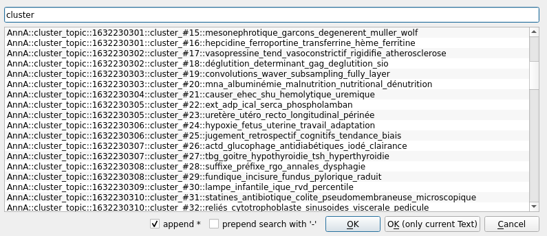
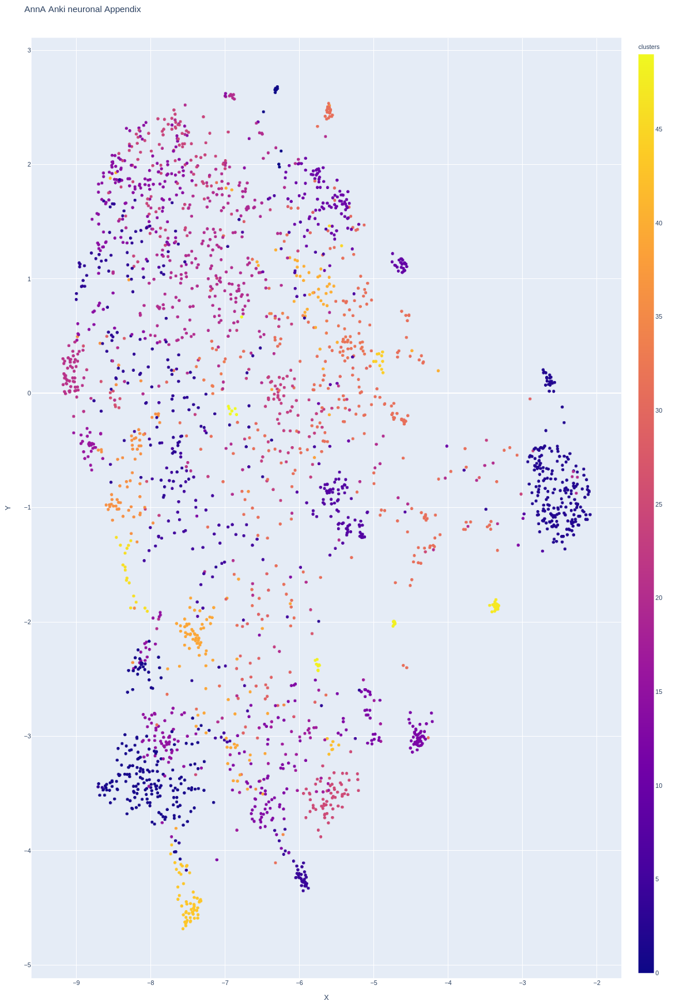

# AnnA : Anki neuronal Appendix
Tired of having to deal with anki flashcards that are too similar when grinding through your backlog? This python script creates filtered deck in optimal review order. It uses Machine Learning / AI to make semantically linked cards far from one another.

## Table of contents
* [One sentence summary](#One-sentence-summary)
* [Note to readers](#Note-to-readers)
* [Other features](#Other-features)
* [FAQ](#FAQ)
* [Getting started](#Getting-started)
* [Usage and arguments](#Usage-and-arguments)
* [Credits and links that were helpful](#Credits-and-links-that-were-helpful)
* [Crazy Ideas](#Crazy-ideas)

## One sentence summary
* When you don't have the time to complete all your daily reviews, use this to create a special filtered deck that makes sure you will only review the cards that are most different from the rest of your reviews.
* When you have too many learning cards and fear that some of them are too similar, use this to automatically bury a portion of them.
* This helps to avoid reviewing **similar** cards on the same day.

## Note to readers
1. I would really like to integrate this into anki somehow but am not knowledgeable enough about how to do it, how to manage anki versions, how to handle different platforms etc. All help is much appreciated!
2. This project relies on [AnkiConnect](https://github.com/FooSoft/anki-connect). I made some contributions to it to add a few features but they have not all been reviewed yet. I am afraid you have to either wait for AnkiConnect to approve of the changes or replace your AnkiConnect folder with [my own](https://github.com/thiswillbeyourgithub/anki-connect). In the mean time some arguments will probably cause issues.
3. I am still changing the code base almost every day, if you tried AnnA and were disappointed, maybe try it another time later. Major improvements are regularly made.
4. This project is still very early and I don't recommend you start using it if you're not skilled enough to do damage control. I have lost a lot of my tags several times and some issue can still happen. Use at your own risks :)
5. I implemented two vectorization methods, either [sBERT](http://sbert.net/) or [subword TF_IDF](https://en.wikipedia.org/wiki/Tf%E2%80%93idf). I am thinking that TF_IDF might be better overall now.

## Other features
* Search for cards in your collection using semantic queries (i.e. typing something with a close `meaning` to a card will find it even if no words are in common).
* Group your cards by semantic cluster using various algorithms (k-means, minibatch k-means, DBSCAN, agglomerative clustering). The topic of each cluster can then be added as tag to your cards. Here's an example on my med school cards:
    
* Create a plot showing clusters of semantic meanings from your anki collection. As you can see on this picture (click to see it in big):
     
* Keeps the OCR data of pictures in your cards, if you analyzed them beforehand using [AnkiOCR](https://github.com/cfculhane/AnkiOCR/).
* Code is PEP compliant, dynamically typed, all the functions have a detailed docstrings. Contributions are welcome, opening issues is encouraged and appreciated.

## FAQ
* **How does it work? (Layman version)** Two possible ways. Either subword [TF_IDF](https://en.wikipedia.org/wiki/Tf%E2%80%93idf), or [sBERT](http://sbert.net/). TF_IDF is a way to count words in a document (anki cards in this case) and understand which are more important. "subword" here means that I used BERT tokenization (i.e. splitting "hypernatremia" into "hyper na tremia" which can be linked to cards dealing with "Na Cl" for example). sBERT is [AI magic](https://en.wikipedia.org/wiki/BERT_(language_model)) that says that `Alcohol withdrawal can be deadly.` and `Stopping alcohol intake too fast can be fatal.` have a similarity of `0.7453`, even though the phrasing is quite different. AnnA uses this to make sure you won't review cards on the same day that are too similar. This is very useful when you have to many cards to review in a day. Use the file `compare.py` to compare strings of text and test the idea. Another example is `retinoblastoma` which is more **similar** to `retin cancer` than to `retin disease` than to `retin` than to `eye`. I intially tried to combine both approach into a common scoring but it proved unreliable. So I decided to keep it simple and provide both options.
* **And in more details?** The goal is to review the most useful cards, kinda like [pareto distribution](https://en.wikipedia.org/wiki/Pareto_distribution) (i.e. review less cards, but review the right one and you should be able to keep afloat in med school). The code is mainly composed of a python class called AnnA. When you create an instance, you have to supply the name of the deck you want to filter from. It will then automatically fetch the cards from your collection, then either use TF_IDF or assign [sentence-BERT](https://www.sbert.net/) vectors to each, compute the distance matrix of the cards and create a filtered deck containing the cards in the optimal order. You can then call other methods if you want. Note that rated cards of the last X days of the same deck will be used as reference to avoid having cards that are too similar to yesterday's reviews. If you want to know more, either open an issue or read the docstrings in the code.
* ~~**When you run it yourself, which arguments do you use?** Personally, for studying I go with `a = AnnA(desired_deck_size="80%", rated_last_X_days=2, to_anki=True)`, and when I have really too much review I'll usually lower the %. For searching cards I'll go with `a = AnnA(deckname="*", compute_opti_rev_order=False)`.~~

* **Will this change anything to my anki collection?** It should not modify anything, if you delete the filtered deck, everything will be back to normal. That being said, the project is young and errors might still be present.
* **Does it work if I have learning steps over multiple days?** Yes, that's my use case. AnnA, depending on the chosen task, either only deals with review queue and ignores learning cards and new cards, or only buries the part of your learning cards that are too similar (ignoring due cards). You can use both one after the other every morning like I do. If you have learning cards in your filtered deck it's because you lapsed those cards yesterday.
* **Does this only work for english cards?** No! TF_IDF use a multilingual BERT uncased tokenization, and the default sBERT model is multilingual too.
* **Can I use this if I don't know python?** Yes! Installing the thing might not be easy but it's absolutely doable. And you don't need to know python to *run* AnnA. I tried my best to make it accessible and help is welcome.
* **What do you call "optimal review order"?** The order that minimizes the chance of reviewing similar cards in a day. You see, Anki has no knowledge of the content of cards and only cares about their interval and ease. Its built-in system of "siblings" is useful but I think we can do better. AnnA was made to create filtered decks sorted by "relative_overdueness" (or other) BUT in a way that keeps *semantic* siblings far from each other.
* **When should I use this?** It seems good for dealing with the huge backlog you get in medical school, or just everyday to reduce the workload. If you have 2 000 reviews to do, but can only do 500 in a day: AnnA is making sure that you will get the most out of those 500. I don't expect the plotting and clustering features to be really used but I had to code them to make sure AnnA was working fine so I might as well leave it :)

* **What are the power requirements to run this?** I wanted to make it as efficient as possible but am still improving the code. Computing the distance matrix can be long if you do this on very large amount of cards but this step is done in parallel on all cores so should not be the bottleneck. Let me know if some steps are unusually slow and I will try to optimize it. With one argument you can use SVD or PCA to do a dimension reduction on your cards, making the rest of the script faster, at the cost of precision. If you want to use AnnA on a very slow device, TF_IDF is probably faster. Computing sBERT vectors is usually long but I cache all the computed values so that should not be a problem.
* **Why is creating the queue taking longer and longer?** Each card is added to the queue after having been compared to the rated cards of the last few days and the current queue. As the queue grows, more computation have to be done. If this is an issue, consider creating decks that are as big as you think you can review in a day. With recent improvements in the code the speed should really not be an issue.
* **Does this work only on Linux?** It should work on all platform, provided you have anki installed and [anki-connect](https://github.com/FooSoft/anki-connect) enabled. But it uses some dependencies that might only work on some CPU architectures, so I'm guessing ARM system would not work but please tell me if you know tried.
* **What is the current status of this project?** I use it daily but am still working on the code. You can expect breaking. I intend to keep developing until I have no free time left. Take a look at the TODO list if you want to know what's in the works. When in doubt, open an issue.
* **Do you mind if I open an issue?** Not at all! It is very much encouraged, even just for a typo. That will at least make me happy. Of course PR are always welcome too.
* **Can this be made into an anki addon instead of a python script?** I have never packaged things into anki addons so I'm not so sure. I heard that packaging complex modules into anki is a pain, and cross platform will be an issue. If you'd like to make this a reality, show yourself by opening an issue! I would really like this to be implemented into anki, and the search function would be pretty nice :)
* **What version of anki does this run on?** I'm currently on 2.1.44 Compatibility relies heavily on anki-connect. Please tell me if you run into issues.

* **If I create a filtered deck using AnnA, how can I rebuild it?** You can't rebuilt it or empty it through anki directly as it would leave you with anki's order and not AnnA's. You have to delete the filtered deck then run the script. Hence, I suggest creating large filtered decks in advance. 
* **What is subword TF_IDF?** Short for "subword term frequency–inverse document frequency". It's a clever way to split words into subparts then count the parts to figure out which cards are related.
* **What is sBERT?** Shot for sentence-BERT. BERT is a machine learning technology that allows to assign high dimensional vectors to words in the context of a sentence. Sentence-BERT is a new method that does essentially the same thing but on a whole sentence. You can read more [at their great website](https://www.sbert.net/).
* **What is the sBERT cache file?** Efficiency-wise, the main bottleneck was creating all the sBERT vector embeddings, so I decided to automatically store them in a pickled dataframe, as new vectors have to be computed only when the card's content has changed.
* **Can I use another sBERT model?** Yes, the model by default is a multilingual model but the English only is supposedly even more awesome. You should consider using it if your cards are only in English. If you do change models, delete the sBERT cache file.
* **Does it work with images?** Not currently but sBERT can be used with CLIP models so I could pretty simply implement this. If you think you would find it useful I can implement it :).
* **What are the supported languages using TF_IDF?** TF_IDF is language agnostic provided you use unicode, but the language model used to split the words was trained on the 102 largest wikipedia corpus.
* **What are the supported languages using sBERT?** The default model is called `distiluse-base-multilingual-cased-v1` and supports "15 languages: Arabic, Chinese, Dutch, English, French, German, Italian, Korean, Polish, Portuguese, Russian, Spanish, Turkish.". There is a v2 that supports more languages with less accurate results. Information about the models can be found [here](https://www.sbert.net/docs/pretrained_models.html).

* **What is the field_mapping.py file?** It's a file with a unique python dictionary used by AnnA to figure out which field of which card to keep. Using it is optional. By default, each notetype will see only it's first field kept. But if you use this file you can keep multiple fields.
* **Why does the progress bar of "Computing optimal review order" doesn't always start at 0?** It's just cosmetic. At each step of the loop, the next card to review is computed by comparing it against the previously added cards and the cards rated in the last few days. This means that each turn is slower than the last. So the progress bar begins with the number of cards rated in the past to indicate that. It took great care to optimize the loop so it should not really be an issue.

## Getting started
* First, **read this page in its entirety, this is a complicated piece of software and you don't want to use it irresponsibly on your cards. The [usage section](#Usage-and-arguments) is especially useful.**
* Make sure the addon [anki-connect](https://github.com/FooSoft/anki-connect) is installed (**see notes above**)
* Clone this repository: `git clone https://github.com/thiswillbeyourgithub/AnnA_Anki_neuronal_Appendix`
* Edit `field_mapping.py` and `acronym_list_example.py` to your liking
* Use python to install the necessary packages : `pip install -r requirements.py`
* Edit the file `autorun_example.py` to suit your needs
* Open AnnA in a python console, for example: `ipython3 -c 'exec(open("autorun_example.py").read())'`

    *if using sBERT: wait a while, the first time you run it on a deck is long because sBERT has to compute all the embeddings*

* Enjoy your filtered deck, but don't empty it or rebuilt it. You can delete it though.
* Open an issue telling me your remarks and suggestion

### Usage and arguments
AnnA was made with usability in mind. With the right arguments, you can have to enter only one command in the console to get your filtered decks. All the settings you might want to edit are in the agument of the AnnA Class. Here are the arguments with the relevant explanation:

 * `show_banner` used to display a nice banner when instantiating the collection. Default is `True`.
 * `deckname` the deck containing the cards you want to review. If you don't supply this value or make a mistake, AnnA will ask you to type in the deckname, with autocompletion enabled (use `<TAB>`). Default is `None`.
 * `reference_order` either "relative_overdueness" or "lowest_interval". It is the reference used to sort the card before adjusting them using the similarity scores. Default is `"relative_overdueness"`. Keep in mind that my relative_overdueness is a reimplementation of the default overdueness of anki and is not absolutely exactly the same but should be a very close approximation. If you find edge cases, please open an issue.
 * `desired_deck_size` indicates the size of the filtered deck to create. Can be the number of cards (500), a proportion of due cards ("80%" or 0.80) or the word "all". Default is `"80%"`.
 * `rated_last_X_days` indicates the number of passed days to take into account. If you rated 500 cards yesterday, then you don't want your today cards to be too close to what you viewed yesterday, so AnnA will find the 500 cards you reviewed yesterday, and all the cards you rated before that, up to the number of days in rated_last_X_days value. Default is `4` (meaning rated today + rated yesterday).
 * `stride` if you have X due cards, want to create a filtered deck containing all of them and have reviewed Y cards yesterday, the stride value will make computing the optimal review order only compares a maximum of `STRIDE` cards at any given time. This eases calculation. Default is `2500`.
 * `scoring_weights` a tuple used to adjust the value of the reference order compared to how similar the cards are. Default is `(1, 1)`. For example: (1, 1.5) means that the algorithm will spread the similar cards farther apart.
 * `log_level` can be any number between 0 and 2. Default is `0` to only print errors. 1 means print also useful information and 2 means print everything.
 * `replace_greek` if True, all greek letters will be replaced with a spelled version. For example `\u03C3` becomes `sigma`. Default is `True`.
 * `keep_ocr` if True, the OCR text extracted using [the great AnkiOCR addon](https://github.com/cfculhane/AnkiOCR/) will be included in the card. Default is `True`.
 * `field_mappin` path of file that indicates which field to keep from which note type and in which order. Default value is `field_mappings.py`. If empty, only takes into account the main (=first) field.
 * `acronym_list` a python dictionary containing acronyms to extend. For example `CRC` can be extended to `CRC (colorectal cancer)`. (The parenthesis are automatically added.) Default is `"acronym_list.py"`. Keep in mind that lowercase acronym will also be matched.

 * `clustering_enable` whether to enable clustering or not. Default is `True`.
 * `clustering_nb_clust` number specifying the number of clusters to look for. Only relevant for some clustering algorithms. Default is `"auto"`, this will look for one cluster every 20 cards.
 * `compute_opti_rev_order` if `False`, won't compute optimal review order and will set `to_anki` to False. Default to `True`.
 * `check_database` at the end of execution, ask anki to check the database or not. Default is `False`.

 * `task_filtered_deck` automatically create the filtered deck or not. Default is `True`.
 * `task_bury_learning` bury some cards of your learning queue if they are too similar. This will bypass a lot other arguments. Default is `False`.
 * `task_index_deck` index all the cards in a deck into sBERT cache. This should be rather long. Obviously this will bypass most arguments. Default is `False`.

 * `sBERT_dim` number of dimensions to keep after doing a PCA reduction. This can speed up the computation somewhat, but with reduced precision. Default is `None` (i.e. disabled by default), setting it to `300` will retain usually more than 95% of the variance. The original number of dimension is 512, but that might depend on the "sBERT" model if you decide to change it.
 * `TFIDF_enable` use tfidf instead of sBERT. This will bypass the sBERT cache file and won't work with the `search_for_notes` function. Default is `True`.
 * `TFIDF_dim` the number of dimension to keep using [SVD](https://scikit-learn.org/stable/modules/generated/sklearn.decomposition.TruncatedSVD.html). Default is `1000`, you cannot disable dimension reduction for TF_IDF because that would result in a sparse matrix.
 * `TFIDF_stopw_lang` a list of languages used to construct a list of stop words (i.e. words that will be ignored). Default is `["english", "french"]`.

 * `debug_card_limit` limit the number of due cards to take into account. It is used for debugging as it allows to run the script quickly. Default is `None`.
 * `debug_force_score_formula` can be used to force seeing similar or different cards etc, to test the algorithm. Default is `None`. Possible values are `only_different` and `only_similar`
 * `prefer_similar_card` I don't know who would use that. It reverses the optimal review order and allows to create a filtered deck grouping your cards that are semantically closest to each other. You can use it to convince yourself that the optimal review order is indeed working. Default is `False`.

AnnA has a number of other built-in methods you can run after instantiating the class. They are especially useful if "to_anki" is set to `False`. Note that methods beginning with a "_" are not supposed to be called by the user and are reserved for backend use. Here's a list of useful methods:

* `compute_clusters` can be used to group the cards by semantic clusters. Several algorithms are implemented: kmeans, minibatch-kmeans, agglomerative clustering, DBSCAN. I can add more if needed.
* `plot_latent_space` can be used to display a 2D projection of your cards using plotly. This opens a new tab in your browser and loads an interactive interface in it. You can color it using tags, clusters, etc. If you have a blank plot without any points, call the method again. I don't understand this issue with plotly yet and help is appreciated :/
* `search_for_notes` will look for cards that are similar to your input. That means that you can type in "localisation of pain in case of kidney stones" and it should find the cards dealing with those concepts even if they don't contain any of those words. This depends on how good sBERT performs on your topic. Different sBERT models can be found. You can use `offline=True` to search directly in the sBERT cache file.
* `display_best_review_order` used as a debugging tool. Allows to check if the order seems correct without having to create a filtered deck.
* `save_df` saves the dataframe containing the cards and all other infos needed by AnnA as a pickle file. Used mainly for debugging. Files will be saved to the folder `DF_backups`
* `show_acronyms` shows the acronym present in your deck that were not extended. Useful if you want to adjust your acronym list.

## TODO
* auto export figure as html instead of openning it
* load the tokenizer so that it bypasses warning messages used for NLP
* improve tokenizer settings for td_idf
* adjust both scoring to their 75% percentile before multiplying by the weights
* add ability to extend the due query
* find a way to remove already created filtered decks
* show the most disimilar cards as well as the most similar
* add a cheatsheet in the usage, showing frequent commands
* sBERT: implement a correction vector, for example "+radiography" would give a bonus to cards alignes with this word and "-radiography" would do the opposite. To help you optimize review sessions.
* investigate wether lapsed cards have to be counted differently
* investigate if it's possible to OCR the subpart of an image occlusion
* look into sentence mining methods from sbert, that might contain useful ideas
* take a look at topic modelling techniques that might be cleaner to invoke than the current ctf-idf implementation
* warn LW
* re read this article for inspiration : http://mccormickml.com/2021/05/27/question-answering-system-tf-idf/
* automatically create a phylogeny of cards based on a distance matrix and see if it's an appropriate mind map, plotly is suitable for this kind of tree
* turn into anki as an addon
* investigate crazy ideas list

## Credits and links that were helpful
* [Corentin Sautier](https://github.com/CSautier/) for his many many insights and suggestions on ML and python. He was also instrumental in devising the score formula used to order the filtered deck.
* [A post about class based tf idf by Maarten Grootendorst on Towardsdatascience](https://towardsdatascience.com/creating-a-class-based-tf-idf-with-scikit-learn-caea7b15b858)
* [The authors of sentence-bert and their very informative website](https://github.com/UKPLab/sentence-transformers)
* [The author of the addon anki-connect](https://github.com/FooSoft/anki-connect), as this project was very useful to test some features.

## Crazy ideas 
### The following is kept as legacy but was made while working on the ancestor of AnnA, don't judge please.
*Disclaimer : I'm a medical student extremely interested in AI but who has trouble devoting time to this passion. This project is a way to get to know machine learning tools but can have practical applications. I like to have crazy ideas to motivate my projects and they are listed belows. Don't laugh. Don't hesitate to contribute either.*
* **Scheduling** Using AnnA to do more different reviews might, somehow, increase the likelihood of [eureka moments](https://en.wikipedia.org/wiki/Eureka_(word)) where your brain just created a new neural paths. That would supposedly help to remember and master a field.
* **Optimize learning via cues** : A weird idea of mine is about the notion that hearing a tone when you're learning something will increase your recall if you have the same tone playing while taking the test. So maybe it would be useful to assign a tone that increases in pitch while you advance in the queue of due cards? I told you it was crazy ideas... Also this tone could play the tone assigned to the cluster when doing random reviews.
* **Mental Walk** (credit goes to a discussion with [Paul Bricman](https://paulbricman.com/)) : integrating AnnA with VR by offering the user to walk in an imaginary and procedurally generated world with the reviews materialized in precise location. So the user would have to walk to the flashcard location then do the review. The cards would be automatically grouped by cluster into rooms or forests or buildings etc. Allowing to not have to create the mental palace but just have to create the flashcards.
    * a possibility would be to do a dimension reduction to 5 dimensions. Use the 2 first to get the spatial location were the cluster would be assigned. Then the cards would be spread across the room but the 3 remaining vectors could be used to derive something about the room like wall whiteness, floor whiteness and the tempo of a music playing in the background.
    * we could ensure that the clusters would always stay in the same room even after adding many cards or even across users by querying a large language model for the vectors associated to the main descriptors of the cluster.
* **Source Walking** : it would be interesting to do the anki reviews in VR where the floor would be your source (pdf, epub, ppt, whatever). The cards would be spread over the document, approximately located above the actual source sentence. Hence leveraging the power of mental palace while doing your reviews. Accessing the big picture AND the small picture.

